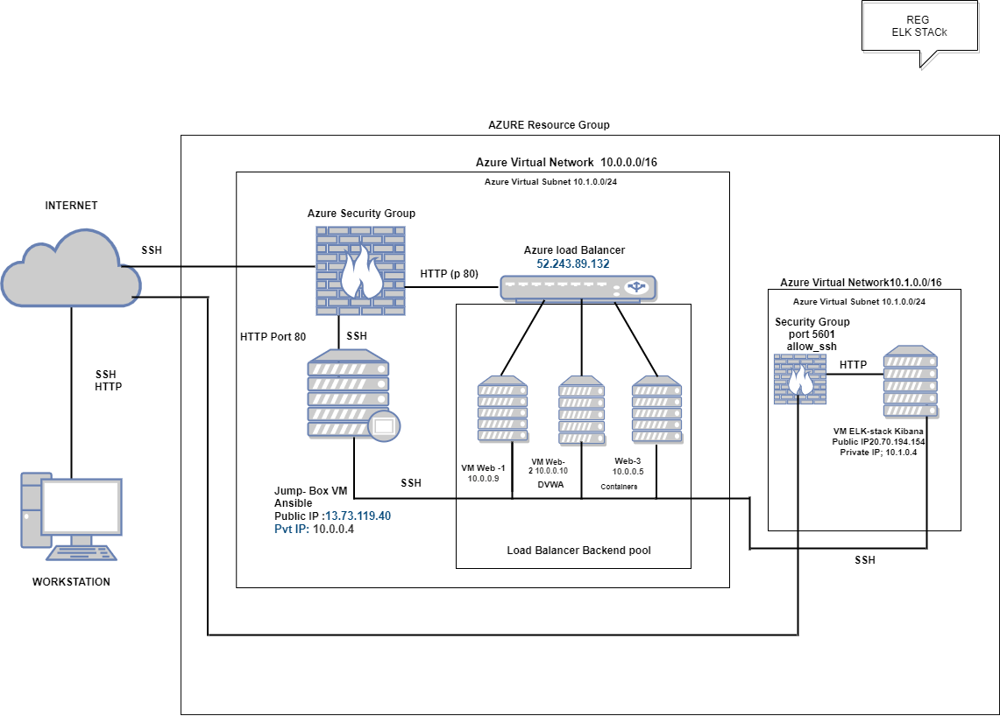
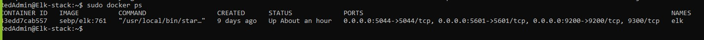

###REG 27/11/2021

## Automated ELK Stack Deployment

The files in this repository were used to configure the network depicted below.

 

These files have been tested and used to generate a live ELK deployment on Azure. They can be used to either recreate the entire deployment pictured above. Alternatively, select portions of the play book file may be used to install only certain pieces of it, such as Filebeat.

  - Enter the playbook file.__

- ansible-install-elk.yml-

This document contains the following details:
- Description of the Topology
- Access Policies
- ELK Configuration
  - Beats in Use
  - Machines Being Monitored
- How to Use the Ansible Build

- [Playbooks.yml](Playbook.yml) 

- [filebeat-playbook.yml](Ansible/filebeat-playbook.yml)
- [ansible.cfg](ansible.cfg)
- [ansible-install-elk.yml](ansible-install-elk.yml)
- [metricbeat-config.yml](metricbeat-config.yml)
- [host](host)

### Description of the Topology

The main purpose of this network is to expose a load-balanced and monitored instance of DVWA, the D*mn Vulnerable Web Application.

Load balancing ensures that the application will be highly available, in addition to restricting access to the network.

 What aspect of security do load balancers protect?
- protects against the DOS attack (denial of service)

What is the advantage of a jump box?_
- Audit Trafic through the network 

Integrating an ELK server allows users to easily monitor the vulnerable VMs for changes to the Data and system logs.

- _What does Filebeat watch for?_
- File logs and changes to the file

- _What does Metricbeat record?_
- Collect metrics from the oprating system and from service runing on the server 

The configuration details of each machine may be found below.
_Note: Use the [Markdown Table Generator](http://www.tablesgenerator.com/markdown_tables) to add/remove values from the table_.

| Name        | Function     | IP Address | Operating System |
|-------------|--------------|------------|------------------|
| Jump Box    |  Gateway     | 10.0.0.4   | Linux            |
| WEB-1       |  Webserver   | 10.0.0.9   | Linux            |
| WEB-2       |  Webserver   | 10.0.0.10  | Linux            |
| WEB-3       |  Webserver   | 10.0.0.5   | Linux            |
| Elk Server  |  Monitoring  | 10.1.0.0   | Linux            |
| Work Station|Access Control|external IP | Git bash         |

### Access Policies

The machines on the internal network are not exposed to the public Internet. 

Only the Jumbox machine can accept connections from the Internet. Access to this machine is only allowed from the following IP addresses:
- work station IP through TCP 5601 Kibana

Machines within the network can only be accessed by Jump box Provisioner.

Which machine did you allow to access your ELK VM? 

- Jumbox box provisioner IP 10.0.0.4 through ssh port 22-

What was its IP address?

- workstation Public IP (my IP) via port tcp 5601-

A summary of the access policies in place can be found in the table below.

                                                                          
| Name          | Publicly Accessible | Allowed IP Addresses                 |
|---------------|---------------------|--------------------------------------|
| Jump Box      |  Yes                |  Work station IP on ssh22            |
| WEB-1         |  No                 |  10.0.0.9 on ssh22                   |
| WEB-2         |  No		              |  10.0.0.10 on ssh22		               |
| ELK Server    |  No		              |  Workstation Public IP using TCP 5601|
| Load Balancer |  No                 |  Workstation Public IP using HTTP 80 |

### Elk Configuration

Ansible was used to automate configuration of the ELK machine. No configuration was performed manually, which is advantageous because...

 What is the main advantage of automating configuration with Ansible?_
- Ansible is a powerful tool, automation simplifies complex IT tasks,

The playbook implements the following tasks:
 In 3-5 bullets, explain the steps of the 

- ELK installation play. E.g.
-name: Config elk VM with Docker

        hosts: elk

        remote_user: sysadmin

        become: true

        tasks:

- install Docker; 

      `docker.io`

      `python3-pip`

      `docker`, which is the Docker Python pip module.

- download image; etc

The following screenshot displays the result of running `docker ps` after successfully configuring the ELK instance.

### Target Machines & Beats

This ELK server is configured to monitor the following machines:

- WEB-1       |  Webserver   | 10.0.0.9 
- WEB-2       |  Webserver   | 10.0.0.10
 

We have installed the following Beats on these machines:

- ELK Server,Web1 and Web2
- The Elk Stack Installed are: Filebeat and Metricbeat 

These Beats allow us to collect the following information from each machine:

- Filebeat:log events
- Metricbeat: metric and syatem statics 

### Using the Playbook
- In order to use the playbook, you will need to have an Ansible control node already configured. Assuming you have such a control node provisioned:

        [webservers]

       #alpha.example.org

        #beta.example.org

        #192.168.1.100

        #192.168.1.110

        10.0.0.9 ansible_python_interpreter=/usr/bin/python3
        10.0.0.10 ansible_python_interpreter=/usr/bin/python3
        10.0.0.5 ansible_python_interpreter=/usr/bin/python3

        [elk]
        10.1.0.4 ansible_python_interpreter=/usr/bin/python3
        #If you have multiple hosts following a pattern you can specify
        # them like this:

        #www[001:006].example.com

        # Ex 3: A collection of database servers in the 'dbservers' group

        #[dbservers]
        #
        #db01.intranet.mydomain.net
        #db02.intranet.mydomain.net
         #10.25.1.56
        #10.25.1.57

        # Here's another example of host ranges, this time there are no
        # leading 0s:

        #db-[99:101]-node.example.com

SSH into the control node and follow the steps below:

### For ELK VM 
- Copy the  file to Ansible/ansible-install-elk.yml 
Ansible Elk Installation and VM configration.

        name: Config elk VM with Docker

        hosts: elk

        remote_user: sysadmin

        become: true

        tasks:

- Update the filebeat -playbook.yml ile to include...

- Run the playbook,using the comand ansible-playbook filebeat-playbook.yml and navigate to Kibana > logs: Add log data> system Log>5:Module Status> Check data to check that the installation worked as expected.

Answer the following questions to fill in the blanks:

Which file is the playbook?

- ansible playbook 

Where do you copy it?

- All host

Which file do you update to make Ansible run the playbook on a specific machine? How do I specify which machine to install the ELK server on versus which to install Filebeat on?_
-update host file 
Which URL do you navigate to in order to check that the ELK server is running
-  http://0.0.0.0:5601/app/kibana

_As a **Bonus**, provide the specific commands the user will need to run to download the playbook, update the files, etc._

- ansible-playbook install-elk.yml

|Command                                               |                 Purpose         |
|------------------------------------------------------|---------------------------------|
|sudo apt-get update                                   | this will update all package    |
|sudo apt install docker.io                            | install docker application      |                 
|sudo service docker start                             | start the docker aplication     |
|systenctl status docker                               |  status of the docker           |
|ansible-m ping all                                    | check the conection of ansible  |
|ssh -keygen                                           | create a ssh key                |
|sudo docker ps -a                                     | list the containers             |                
|sudo docker start                                     | start the specified             |
|sudo docker run -ti cybersecurity/ansible bash        | run and create docker image     |
|sudo docker pull cybersecurity/ansible                | download the docker file        |
